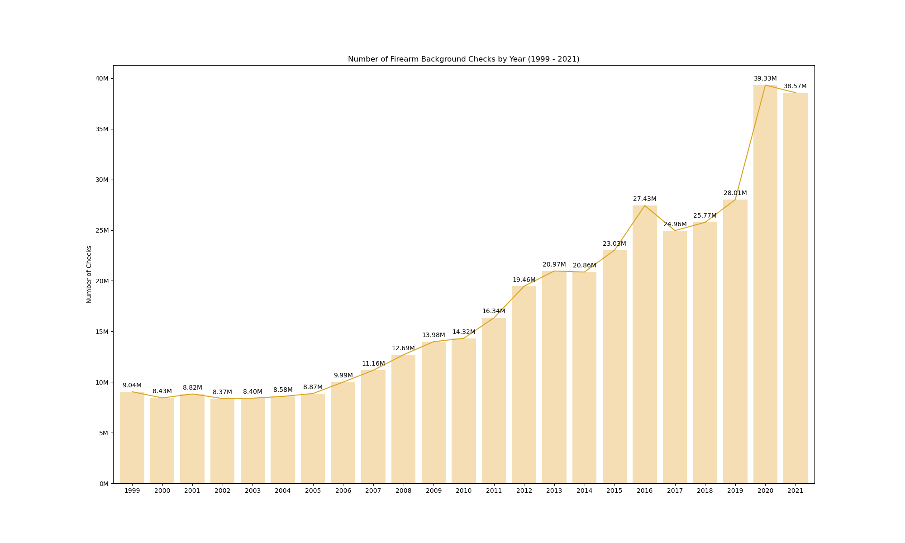
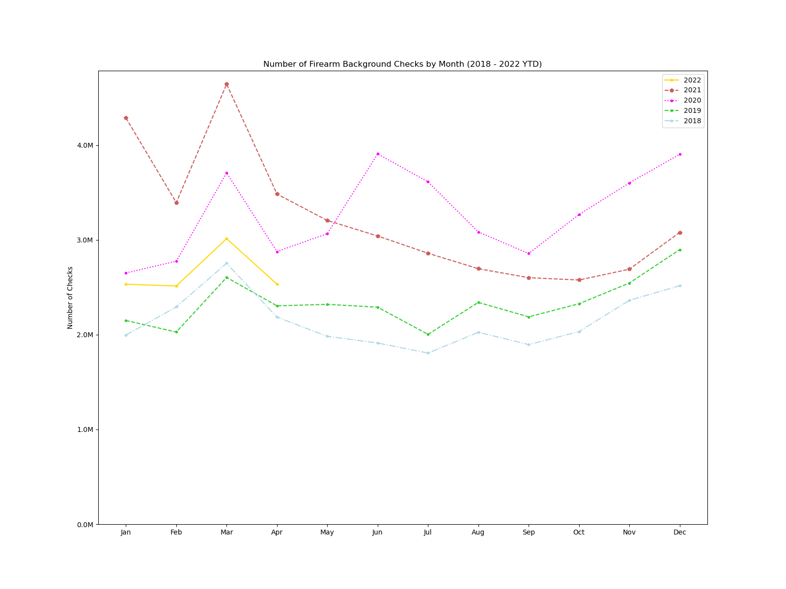
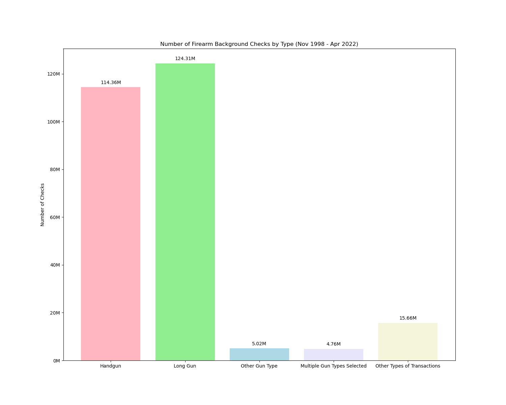
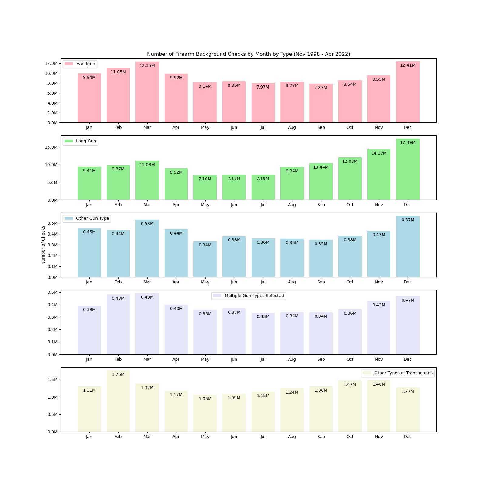
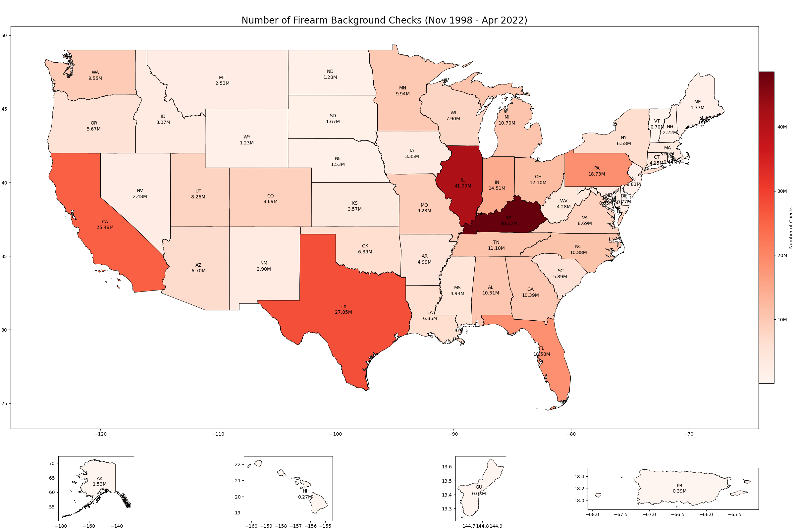
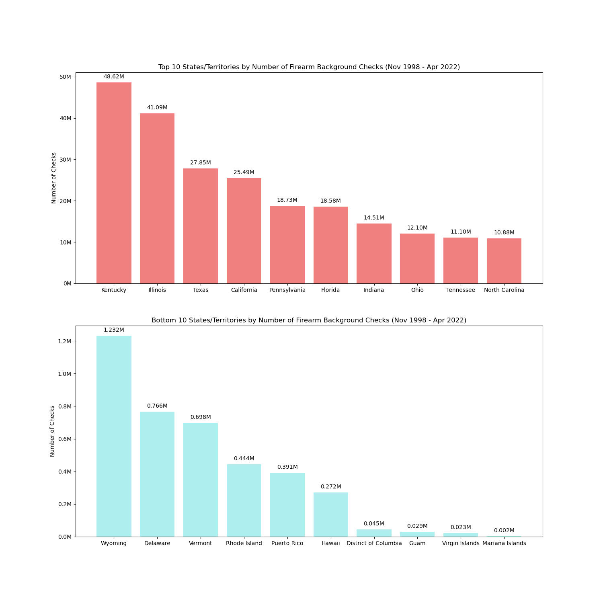

I have visualized the FBI NICS Firearm Background Checks dataset and performed exploratory data analysis (EDA) using Python and its frameworks, Matplotlib, Pandas, and GeoPandas.

The summary of my findings is as follows:
- The number of background checks is trending upward, and it has increased almost every year for the past two decades.
- The number of background checks is higher in March and December. There appear to be more firearm sales in the first and fourth quarters of the year.
- Most background checks are for handgun and long gun purchases. 
- A considerably higher number of background checks are done in Kentucky, Illinois, Texas, and California. The number is exceptionally high in Kentucky, considering the population.

#### Number of Checks by Year

#### Number of Checks by Month in Recent Years

#### Number of Checks by Type

#### Number of Checks by Month by Type

#### Number of Checks by State

#### Top 10 and Bottom 10 States by Number of Checks

